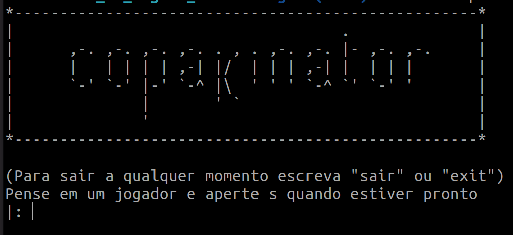
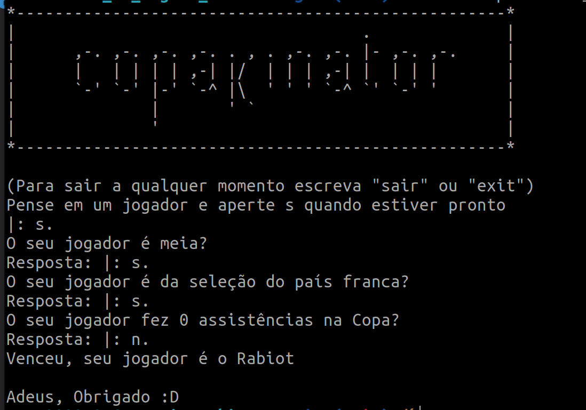
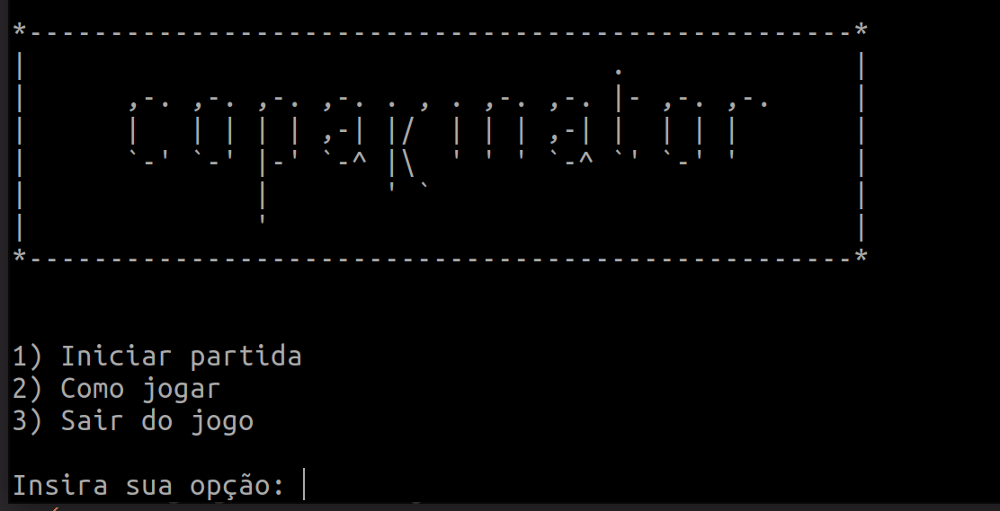
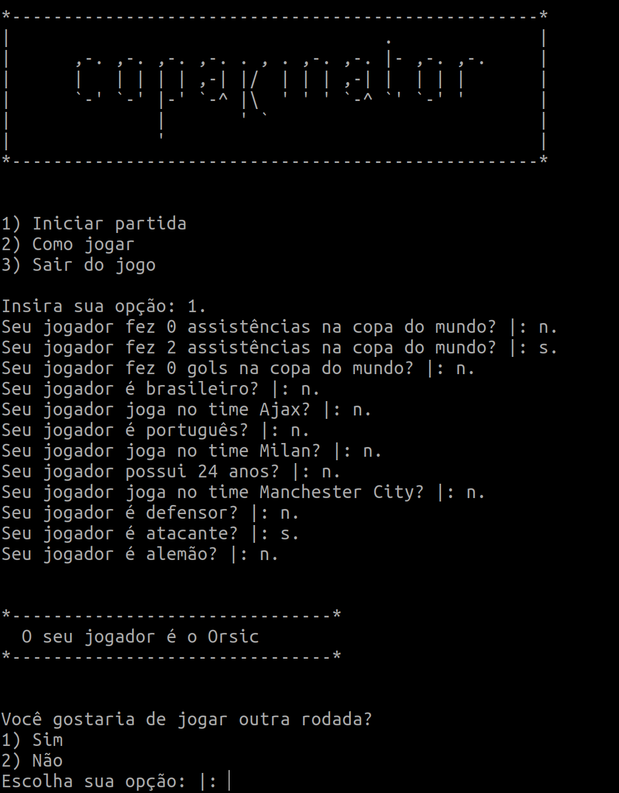
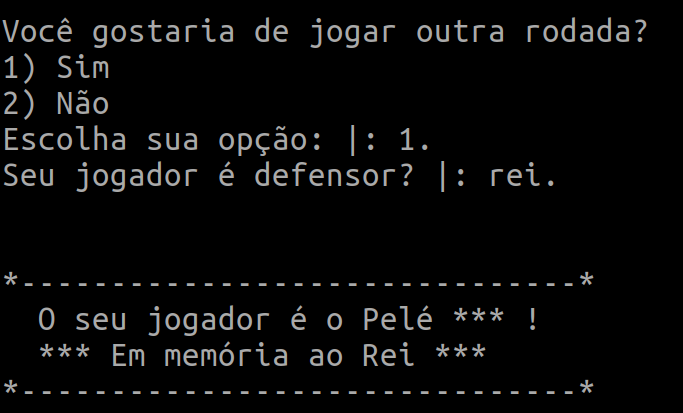

# Akinator - Copa do Mundo

**Disciplina**: FGA0210 - PARADIGMAS DE PROGRAMAÇÃO - T01 <br>
**Nro do Grupo**: 04<br>
**Paradigma**: Lógico<br>

## Alunos
| Matrícula  | Aluno                                    |
| ---------- | ---------------------------------------- |
| 19/0124997 | Amanda Jeniffer Pereira Nobre            |
| 19/0101792 | Ana Carolina Rodrigues Leite             |
| 17/0101711 | Daniel Barcelos Moreira                  |
| 16/0119006 | Enzo Gabriel Guedes Queiroz Saraiva      |
| 18/0018604 | Hugo Sobral de Lima Salomão              |
| 18/0021974 | Leonardo da Silva Gomes                  |
| 17/0111288 | Micaella Lorraine Gouveia de Lima        |

## Sobre 
O projeto consiste em um joguinho bastante conhecido na internet chamado [Akinator](https://pt.akinator.com/) cuja proposta é adivinhar o personagem real ou fictício 
que o usuário está pensando. Basicamente são feitas perguntas que devem ser respondidas com sim ou não e partir disso é possível chegar na resposta certa. Para o projeto foram criadas duas versões com arquiteturas diferentes. 

No nosso projeto o escopo do jogo está limitado aos jogadores das seleções da Copa do Mundo de 2022, sendo possível responder perguntas sobre
- Time do jogador
- Assistências
- Gols
- Idade
- Posição
- Seleção

## Screenshots
### Versão 1



### Versão 2




## Instalação 
**Linguagens**: Prolog<br>
**Tecnologias**: SWI Prolog<br>
**Pré-requisitos**:<br>
- É possível rodar com o Docker, sendo necessária sua instalação.
- É possível rodar com o SWIProlog, sendo necessária sua instalação. Segue os guias abaixo
    - [Mac OS ](https://www.youtube.com/watch?v=sAZbP2cotiM)
    - [Linux  ](https://www.youtube.com/watch?v=3ghQz1SRJ84)
    - [Windows](https://www.youtube.com/watch?v=FE1d5vauTlU)

## Uso 

Tanto para a Versão 1 como para a Versão 2 foram criados ambientes isolados.

### Versão 1
```
docker-compose run v1
```

### Versão 2
```
docker-compose run v2
```

Caso tenha algum problema, você pode tentar rodar da seguinte maneira *(é neessária a instalação do SWIProlog)*:

1. Entre na pasta /v2
2. Rode o comando: ```swipl app.pl```

## Vídeo

* [**Vídeo da Apresentação**](https://youtu.be/-_BqL57GA6k)
* [**Link da versão 2 rodando**](https://youtu.be/OwEonY1JrEk)
* [**Link da versão 1 rodando**](https://youtu.be/nBdPFumx8ao)
 

## Participações

| Nome do Membro                      | Contribuição | Significância da Contribuição para o Projeto |
| - | - | - |
| Amanda Jeniffer Pereira Nobre       | População do banco de dados, criação das perguntas | Boa |
| Ana Carolina Rodrigues Leite        | População do banco de dados, criação das perguntas | Boa |
| Daniel Barcelos Moreira             | População do banco de dados, criação das perguntas | Boa |
| Enzo Gabriel Guedes Queiroz Saraiva | Definição de uma estrutura inicial do projeto, criação do menu, criação das perguntas, tentaiva de uso de uma interface | Excelente | 
| Hugo Sobral de Lima Salomão         | Desenvolvimento das versões 1 e 2, como foco na segunda, desenvolvimento da lógica de randomização, perguntas e tratamento com as respostas          | Excelente                                    |
| Leonardo da Silva Gomes             | Desenvolvimento das versões 1 e 2, com foco na primeira, desenvolvimento da lógica de randomização, perguntas e tratamento com as respostas           | Excelente                                    |
| Micaella Lorraine Gouveia de Lima   | Desenvolvimento das versões 1 e 2, com foco na primeira, desenvolvimento da lógica das perguntas e tratamento com as respostas, população do banco de dados         | Excelente                                    |

(Excelente/Boa/Regular/Ruim/Nula)

## Outros 

### Lições Aprendidas
- Uso da linguagem prolog
- Entendimento do paradigma funcional
- Manipulação de base de dados em memória

### Percepções
- O grupo conseguiu entender a diferença entre o Paradigma Funcional para o Lógico a partir do momento em que nos vimos aplicando a maioria das funções de forma recursiva, que é mais utilizado no paradigma funcional.
- Tivemos então que adaptar o código ao pensamento lógico.

### Contribuições e Fragilidades
- O grupo teve dificuldade de inicializar o projeto. Alguns membros se dedicaram para o estudo da linguagem, e com o recesso, não foi possível fazer reuniões com todo o grupo, já que alguns membros estavam viajando.
- Foram pensadas dois tipos de soluções, e com a falta de tempo de desenvolvimento, o time de dividiu em dois grupos para a implementação das duas ideias.
- Os membros que conseguiram entender melhor a linguagem ficaram mais ativos e responsáveis pela lógica do jogo, como as perguntas seriam feitas, como elas estariam atreladas aos jogadores.

### Trabalhos Futuros
- Ampliar a base de dados
- Criar uma interface gráfica

## Fontes
- SWIProlog. Disponível em <https://www.swi-prolog.org/>. Ùltimo acesso em 05/01/2023.
- Base de dados da Copa do Mundo de 2022. Disponível em <https://www.espn.com.br/futebol/liga/_/nome/fifa.world>. Último acesso em 05/01/2023.
